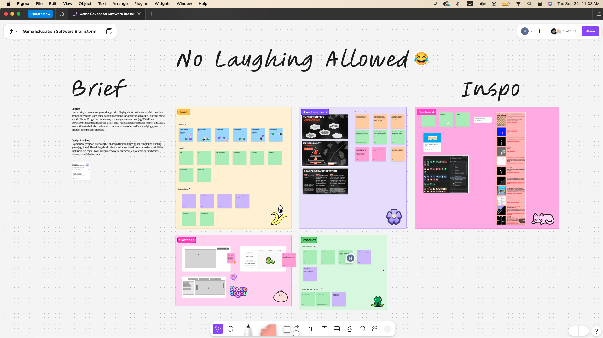

# Week 2

## Summary

_What happened this week — research, decisions, team discussions, initial ideas._

## Process

_Sketches, prototypes, tests. Embed images/gifs from the `images/` folder, e.g.:_

```md

```
![figjam board the team worked on]

https://www.figma.com/board/r6SQI1vLGT2OgyXQXaSpqu/Game-Education-Software-Brainstorm?node-id=11-1222&t=i8Sll9vfpaxR3LYa-1




## Reflection

Since I was absent the first week, I was able to meet my teammates. We got to work on a FigJam board, which a few of us were already familiar with. We went over our brief together and started putting together a structured approach to our project. 

We defined the different roles in the team: Product Designer, Illustrator/Graphic Designer, UI/UX Designer, Web Developer, Project Manager, and Sound Designer. We agreed that we did not have to be strict in the assignment of these roles, as most of the team come from a multidisciplinary background. 

When researching our client, the brief referred to the client's website that had games they had created. More specifically, they had a selection of games tagged as variations. We spent some time playing and exploring these variation games as we would be working towards prototyping an educational game in this style but for users with no prior game development experience. 

In preparation for next week's interview with our client, we discussed key principles in running effective interviews. We agreed to have a dedicated note-taker and interviewer, as this would allow for the best results in both tasks. We also outlined interview questions that would best help direct our work for the coming weeks. 

When doing high-level sketches and discussing the final output, we landed on mostly modular forms of games with the educational game in mind. Drag and drop was one of the key mechanics in putting together blocks of functions based on the theme of the game. 

An important discussion we had about the project was scope. The brief describes a final output as a mid-to-high-level prototype in Figma, and a few members of the team hoped to have a greater project by the end of it, pointing out that five team members can output much more than a Figma prototype. I pushed back on this notion a bit, as the work we put in the iterative aspect of the project is as valuable as the final output. This is reflected in the grading distribution of the course. 

Overall, I believe our team had very good chemistry and a sense of play that will make for a fun and creative environment to work in!

## Next Step

_TBD — link to next week's entry once created:_
`[Week 3](../week-03/README.md)`

## Table of Contents

| Week | Entry |
| --- | --- |
| 2 | [Week 2](../week-02/README.md) |

[← Back to journal index](../../README.md)
