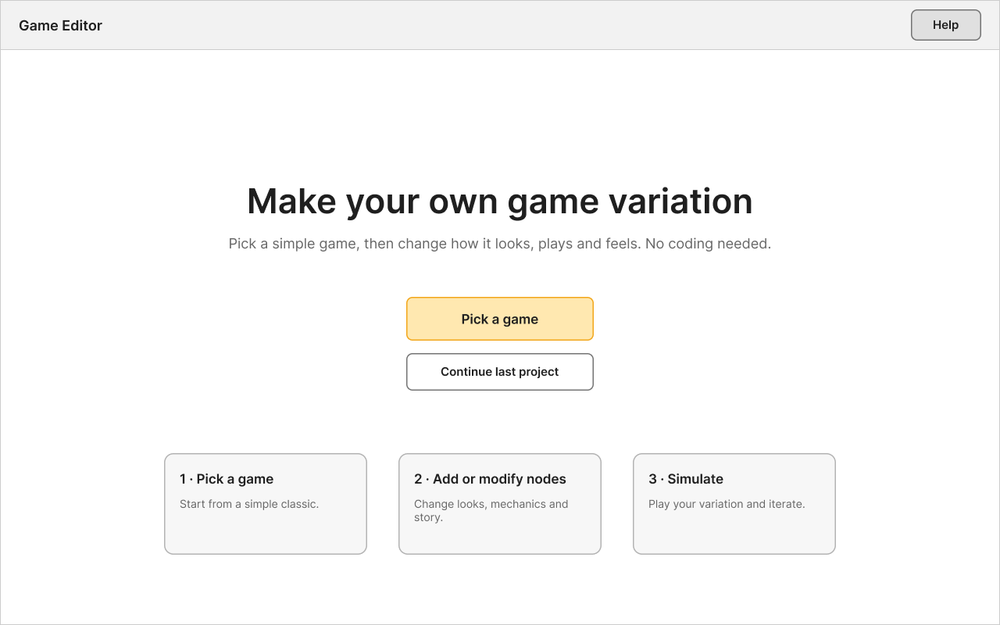
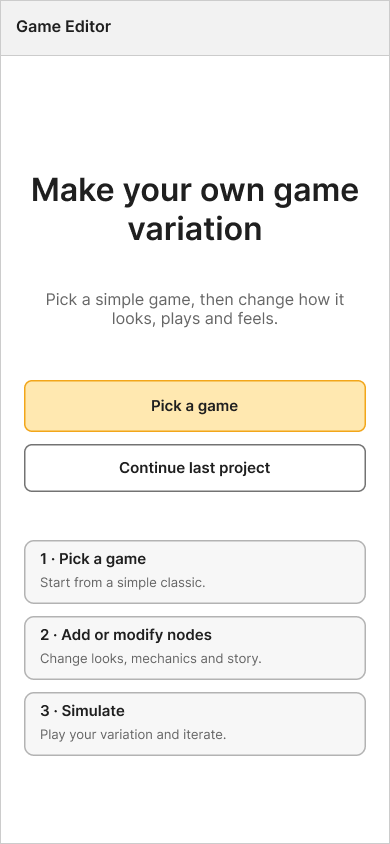

# Week 4

## Process

*Sketches, prototypes, tests. Embed images/gifs from the `images/` folder, e.g.:*

```

```

**Wireframes (desktop and mobile)**

Based on the team's FigJam sketches and user flow, I built low-fidelity wireframes of the game editor: Home → Pick game → Base engine → Add node (Aesthetics / Mechanics / Story) → Pick a node setting → Modify node → Link node to another → Simulate game.

<https://www.figma.com/board/r6SQI1vLGT2OgyXQXaSpqu/Game-Education-Software-Brainstorm?node-id=172-429&t=i8Sll9vfpaxR3LYa-1>





This is a first draft of the wireframes, so before I commit to an interactive prototype, I want to get feedback from my teammates and my client. The other part I'm torn on is part of my reflection last week was about how Pippin wanted an educational game that did not require any technical knowledge from the users part. I'm a bit concerned with the sliders and the nodes and was wondering if there was a wireframe to be made without and UI elements and only in the gameplay can you iterate the different mechanics. I brought this up in a previous meeting with the team, but it sounded like we had different understandings of this. Something to possibly bring up again to Pippin, and making another low-fidelity wireframe of this could be interesting. 

## Learning Activity: Analyzing Pippin Barr's Games (O1, O2)

**Activity:** Review Pippin Barr's existing games (PONGS, SNAKISMS, Variations) and list what a player can change in each, to decide which three settings the prototype will let users edit.

**Games played:** [list which versions you played in each, and the date]

### PONGS

**Overview:** [one or two sentences: what it is, how many versions you played, how you picked them]

| Variation | What changed vs. base Pong | Type of change (aesthetic / mechanic / story) | How it felt |
|---|---|---|---|
| [name] | [change] | [type] | [one line] |
| [name] | [change] | [type] | [one line] |
| [name] | [change] | [type] | [one line] |


**Reflection prompts** (answer in your own words):
- What did Pippin change most often across the versions I played? [your answer]
- Which of these changes would be easy for a non-coder to make in our editor, and which would be hard? [your answer]
- Which version surprised me most, and what exactly caused the surprise? [your answer]
- What did I learn about what a game is "made of"? [your answer]

### SNAKISMS

**Overview:** [one or two sentences: how the philosophies are expressed through the mechanics, and which ones I played]

| Variation (ism) | What changed vs. base Snake | Type of change (aesthetic / mechanic / story) | How it felt |
|---|---|---|---|
| [name] | [change] | [type] | [one line] |
| [name] | [change] | [type] | [one line] |
| [name] | [change] | [type] | [one line] |


**Reflection prompts:**
- How does a small rule change express an idea (a "philosophy") without any extra text? [your answer]
- Which versions changed the **goal** rather than the look or speed, and could my editor allow that? [your answer]
- Where did Story and Mechanics overlap, so that one setting couldn't be separated from the other? [your answer]

### Variations (overview of the collection)

**Games I opened from the list:** [names]

**Reflection prompts:**
- What patterns repeat across his variation games (a base game plus a theme, a constraint, a flipped goal, a hybrid)? [your answer]
- Which of these approaches feels closest to what our editor should allow? [your answer]
- Did I see the effect of each change immediately? What does that suggest for the prototype (Bret Victor's feedback idea)? [your answer]

### Outcome

**What a player can change, by game:**

| Game | Inputs the player controls | What varies between versions |
|---|---|---|
| PONGS | [list] | [list] |
| SNAKISMS | [list] | [list] |
| Variations (other games) | [list] | [list] |

**Three settings the prototype will let users edit** (outcome from the contract):

1. [setting] — [why it matters, which type of change it is, how a user might change it in our editor]
2. [setting] — [why it matters, which type of change it is, how a user might change it in our editor]
3. [setting] — [why it matters, which type of change it is, how a user might change it in our editor]

**How this affects the prototype:** [how these three settings feed the Figma interactive components, variables and conditionals, and where they show up in the editor flow]

**What I'd like to check with the team or client:** [questions, e.g. whether absurd or conflicting settings should be allowed]

## Reflection

[Write your weekly reflection here in your own words: what the team did this week, decisions made, what you personally contributed (wireframes, learning activity), what surprised you, and what you'd do differently.]

## Next Step

[Week 5](https://github.com/haniflearnscoding/CART470_ProcessJournal/blob/main/entries/week-05/README.md)

## Table of Contents

| Week | Entry                                                                                   |
| ---- | --------------------------------------------------------------------------------------- |
| 2    | [Week 2](https://github.com/haniflearnscoding/CART470_ProcessJournal/blob/main/entries/week-02/README.md) |
| 3    | [Week 3](https://github.com/haniflearnscoding/CART470_ProcessJournal/blob/main/entries/week-03/README.md) |
| 4    | [Week 4](https://github.com/haniflearnscoding/CART470_ProcessJournal/blob/main/entries/week-04/README.md) |

[← Back to journal index](https://github.com/haniflearnscoding/CART470_ProcessJournal/blob/main/README.md)
